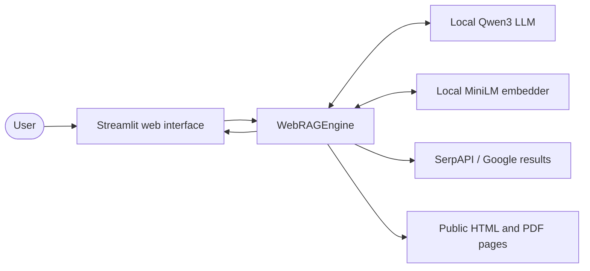
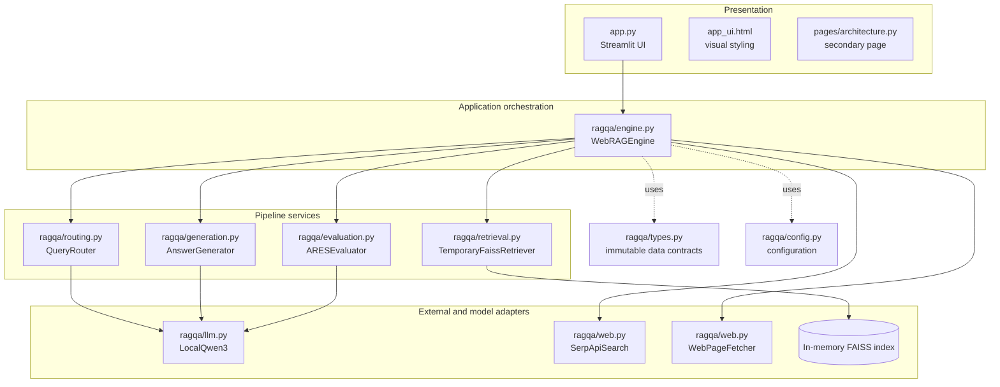
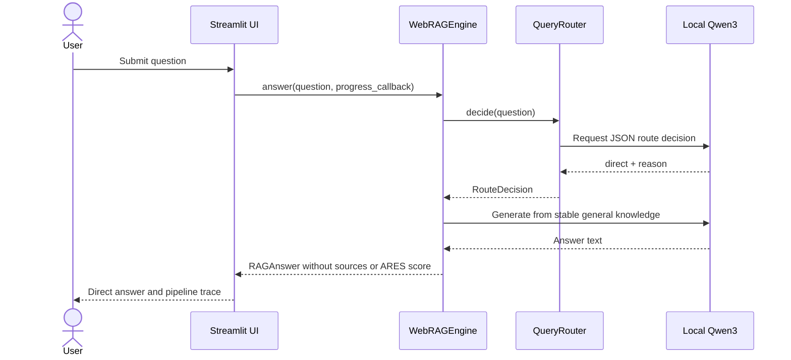
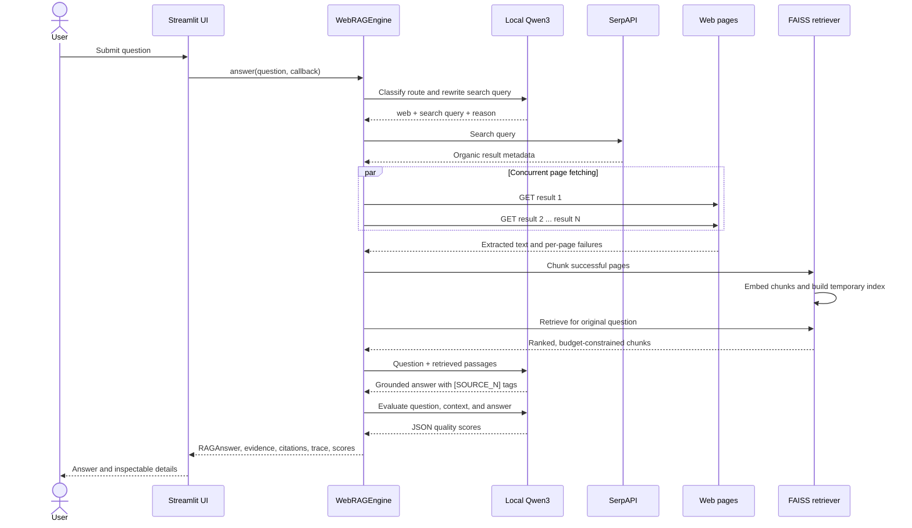
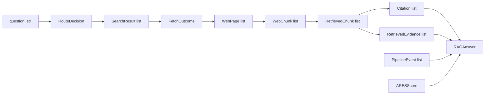

# Architecture of the Direct-or-Web RAG Assistant

## 1. Purpose and scope

This application is a teaching-sized **Retrieval-Augmented Generation (RAG)** system. It answers a question in one of two ways:

1. **Direct route:** use a local Large Language Model (LLM) when the question can be answered from stable general knowledge.
2. **Web route:** search the web, retrieve relevant passages, and ask the same local LLM to answer only from those passages.

The important architectural idea is that RAG is not one model. It is a pipeline of components that acquire information, transform it, retrieve a small relevant context, generate an answer, and assess that answer.

This document describes the implementation in this repository. It is intended for MSc students studying software architecture, information retrieval, natural language processing, or applied machine learning.

## 2. System context



The system is mostly local. The Qwen3 language model, MiniLM embedding model, tokenization, FAISS index, answer generation, and evaluation run on the user's machine. A web-routed question crosses the machine boundary when the application calls SerpAPI and fetches public web pages.

There is no application database. Conversation results are held in Streamlit session state, while each web index exists only during one call to `WebRAGEngine.answer()`.

## 3. Architectural style

The application combines three styles:

- **Layered architecture:** presentation, orchestration, domain services, and infrastructure adapters are separated.
- **Pipeline architecture:** the output of each RAG stage becomes the input of the next stage.
- **Dependency injection:** the engine can receive an alternative LLM, embedder, search provider, or page fetcher. Tests use these seams to avoid models and network calls.

The central façade is `WebRAGEngine`. It creates the components and coordinates them, but focused modules own the detailed behavior.

## 4. Component view



### Responsibilities

| Component | Responsibility | Important non-responsibility |
|---|---|---|
| `app.py` | Load models on demand, accept questions, display progress, answers, sources, and scores | Does not implement retrieval or generation |
| `WebRAGEngine` | Execute the use case and assemble the final `RAGAnswer` | Does not know Streamlit presentation details |
| `QueryRouter` | Ask the LLM to choose `direct` or `web` and produce a search query | Does not perform the search |
| `SerpApiSearch` | Search, validate URLs, remove fragments and duplicates, and enforce the result limit | Does not download result pages |
| `WebPageFetcher` | Fetch pages concurrently and extract HTML/PDF text | Does not rank passages |
| `TemporaryFaissRetriever` | Token-aware chunking, embedding, indexing, and constrained similarity retrieval | Does not generate natural-language answers |
| `AnswerGenerator` | Produce either a direct answer or an evidence-grounded answer with source tags | Does not verify source quality |
| `ARESEvaluator` | Ask the LLM for three quality scores and an explanation | Is not an independent ground-truth judge |
| `LocalQwen3` | Download/load the correct local model backend and expose one `generate` interface | Does not decide application policy |
| `types.py` | Define immutable messages and results shared between components | Contains no pipeline behavior |

`rag_engine.py` is a backward-compatible import façade. New code should normally import from `ragqa` or its specific modules.

## 5. Runtime behavior

### 5.1 Model initialization

The application does not load large models during every Streamlit script run. The user selects **Load local models**, after which the initialized engine is stored in `st.session_state`.

`LocalQwen3` selects its backend by platform:

- Apple Silicon: MLX with `Qwen/Qwen3-8B-MLX-4bit`.
- Other supported platforms: Hugging Face Transformers with `Qwen/Qwen3-8B` and 4-bit BitsAndBytes quantization.

The embedding model is `sentence-transformers/all-MiniLM-L6-v2`. A `QWEN_MODEL_ID` environment variable can override the generation model. `SERPAPI_KEY` is read first from the environment and then from Streamlit secrets.

### 5.2 Direct route



No SerpAPI credential is needed and no network search occurs on this path. The direct path is cheaper and faster, but it relies on the model's internal knowledge.

### 5.3 Web RAG route



Notice that the search engine receives the rewritten search query, while semantic retrieval uses the user's original question. Search rewriting helps web discovery; retaining the original question helps select passages that address the user's actual intent.

## 6. Retrieval pipeline in detail

### 6.1 Search and ingestion

SerpAPI results are accepted only when they have an HTTP(S) URL. URL fragments are removed, equivalent URLs are deduplicated, and at most `search_result_limit` results are retained (currently 10).

The selected pages are downloaded concurrently using a thread pool. Fetches follow redirects and have two important bounds:

- 12-second timeout per request.
- 5 MiB maximum response size, checked from both the header and streamed bytes.

HTML is reduced to main text using Trafilatura. PDF text is extracted with pypdf. Whitespace is normalized, and documents with fewer than 100 extracted characters are rejected.

Partial failure is allowed: failed pages are recorded and successful pages continue through the pipeline. If every page fails, the web route stops with a user-facing `WebRAGError`.

### 6.2 Chunking

Each page is tokenized with the `cl100k_base` tokenizer and divided into windows:

```text
chunk size    = 300 tokens
overlap       =  50 tokens
window stride = 300 - 50 = 250 tokens
```

Overlap reduces the chance that a relevant sentence or concept is split across a hard boundary. Every `WebChunk` retains provenance: title, URL, original search rank, chunk identifier, and token count.

The tokenizer used to budget chunks is not Qwen's own tokenizer. It provides a practical common estimate, but the real Qwen prompt token count can differ. This is an engineering approximation worth discussing in production designs.

### 6.3 Embeddings and similarity search

MiniLM converts each chunk into a dense vector. FAISS L2-normalizes all vectors, then stores them in an `IndexFlatIP` exact-search index. For normalized vectors, inner product equals cosine similarity:

```math
\operatorname{cosine}(q,d)
= \frac{q \cdot d}{\lVert q\rVert_2\lVert d\rVert_2}
= q' \cdot d'
```

where `q'` and `d'` are the normalized query and document vectors. A larger score indicates greater semantic similarity.

`IndexFlatIP` is exact rather than approximate: it compares the query with every indexed chunk. This is simple and appropriate for a small per-request corpus, but its search cost grows linearly with the number of chunks.

### 6.4 Context selection

The retriever first asks FAISS for an over-sampled candidate set: up to four times the maximum desired chunk count, with a minimum candidate target of 12 (bounded by the actual corpus size). It then applies application constraints:

- At most 6 chunks in the final context.
- At most 1,400 estimated tokens in total.
- At most 2 chunks from one URL.
- Prefer one chunk from each new source before adding second chunks.

This is a simple form of diversity-aware retrieval. Pure top-*k* similarity could fill the prompt with several nearly identical chunks from one page; the two-pass selection increases source coverage.

### 6.5 Grounded generation and citations

Retrieved chunks are placed in the prompt as `[SOURCE_1]`, `[SOURCE_2]`, and so on. The system instruction requires the LLM to:

- use only the supplied passages;
- cite factual claims with the corresponding source tags;
- state when evidence is insufficient;
- avoid invented citations.

After generation, the application creates a `Citation` only for a source tag that actually appears in the answer. The UI replaces those tags with numbered clickable links. This preserves a direct mapping between generated claims and retrieved passages, although it does not prove that each claim is logically entailed by its cited passage.

## 7. Data contracts and transformations

The immutable dataclasses in `ragqa/types.py` make boundaries explicit:



`RAGAnswer` is the presentation-facing aggregate. It contains the answer plus enough metadata to explain how the result was produced: route and reason, search query, source outcomes, retrieved excerpts and scores, citations, pipeline trace, evaluation, counts, and latency.

Using immutable data transfer objects has two educational benefits: stages communicate through visible contracts, and accidental mutation of earlier pipeline outputs is discouraged.

## 8. State, lifecycle, and privacy boundary

There are three useful lifetimes to distinguish:

| Lifetime | Data |
|---|---|
| Persistent local model cache | Downloaded Qwen and MiniLM model files |
| Streamlit user session | Loaded engine/model objects, answer history, and current result |
| One web request | Full fetched pages, chunks, embeddings, and FAISS index |

The temporary index is a local variable created inside retrieval. Once `answer()` returns and request-local references become unreachable, full pages, embeddings, and the index can be reclaimed. The returned answer retains compact excerpts, URLs, scores, and trace metadata.

This reduces long-term storage and stale-index problems. It also means repeated questions repeat web ingestion and embedding work; there is no persistent cache or shared knowledge base.

For privacy analysis, distinguish **local inference** from **fully offline operation**. Direct questions can remain local after models are downloaded. Web questions disclose the rewritten query to SerpAPI and make requests to selected websites.

## 9. Evaluation and observability

### Pipeline observability

The engine emits `PipelineEvent` values through a callback. The UI progressively renders routing, search, fetch, chunking, indexing, retrieval, generation, and evaluation events. The same trace is stored with the answer, so the pipeline is inspectable after completion.

This callback keeps Streamlit out of the engine and is a small example of dependency inversion: the application layer reports events without knowing how they will be displayed.

### ARES-style evaluation

For web answers, the local LLM scores three dimensions from 0 to 1:

- **Context relevance:** do the retrieved passages help answer the question?
- **Faithfulness:** are answer claims supported by those passages?
- **Answer relevance:** does the answer address the question?

The overall score is their unweighted arithmetic mean. Invalid evaluator output falls back to 0.5 for all dimensions.

This module is **ARES-style**, not a full implementation of the published ARES evaluation framework. It is a single-model, prompt-based diagnostic. Because the generator and evaluator use the same LLM, their errors can be correlated; these scores should support debugging, not be treated as objective accuracy measurements.

## 10. Error handling and resilience

The system uses conservative behavior at several boundaries:

- Empty questions are rejected before routing.
- Invalid router JSON falls back to web search, since externally verifiable evidence is safer than an unsupported direct answer.
- A missing SerpAPI key fails only if the web route is selected.
- Invalid and duplicate search URLs are discarded.
- Individual page failures are logged while other pages continue.
- A web route stops when search returns no usable result, all pages fail, no usable chunks are produced, or no chunk fits the context budget.
- Invalid evaluator output does not discard an otherwise usable answer; it produces neutral fallback scores.

`WebRAGError` represents failures that can be explained to the user. The UI catches it separately from unexpected programming or infrastructure exceptions.

One limitation is that the pipeline is synchronous from the user's perspective. Page downloads are concurrent, but only one submitted question is processed in the Streamlit session at a time, and there is no cancellation or retry policy.

## 11. Configuration

Defaults are centralized in the frozen `PipelineConfig` dataclass:

| Setting | Default | Architectural effect |
|---|---:|---|
| Search result limit | 10 | Breadth of web ingestion |
| Search timeout | 15 s | Bound on search latency |
| Fetch timeout | 12 s | Bound on each page request |
| Maximum response | 5 MiB | Memory and download protection |
| Chunk size | 300 tokens | Passage granularity |
| Chunk overlap | 50 tokens | Boundary continuity versus duplication |
| Context budget | 1,400 tokens | Evidence allowed in generation prompt |
| Maximum context chunks | 6 | Number of evidence passages |
| Maximum chunks per source | 2 | Source diversity |

Passing a different `PipelineConfig` to the engine supports experiments without scattering constants across modules.

## 12. Testing architecture

The tests replace expensive or non-deterministic dependencies with small fakes:

- `FakeLLM` returns controlled routing, generation, and evaluation responses.
- `FakeEmbedder` returns deterministic vectors.
- Injected search and fetch functions replace SerpAPI and public websites.
- Streamlit's `AppTest` checks the UI without loading models.

This makes the test suite fast, offline, deterministic, and free of API quota usage. Tests cover both routes, router fallback, credentials, URL cleanup, partial and total page failure, chunk overlap, token budgets, source diversity, citations, traces, and evaluation scores.

The design demonstrates a general principle: architecture is easier to test when side effects sit behind narrow interfaces and orchestration depends on replaceable collaborators.

## 13. Key design decisions and trade-offs

### Local generation

**Benefit:** prompts and retrieved text are processed locally, with no hosted LLM cost.  
**Cost:** model download, memory use, hardware-dependent backends, and lower capability than some hosted models.

### LLM-based routing

**Benefit:** routing can reason about freshness and question intent without a large rule set.  
**Cost:** it adds an inference call and can make inconsistent decisions. The JSON parser and web fallback reduce, but do not eliminate, this risk.

### Request-local exact index

**Benefit:** simple lifecycle, fresh evidence, no vector database service, and no cross-user corpus retention.  
**Cost:** repeated downloads and embeddings, no reuse across questions, and linear exact search.

### Open-web retrieval

**Benefit:** current and broad information.  
**Cost:** pages can be blocked, misleading, duplicated, dynamically rendered, or malicious. Search rank and embedding similarity are relevance signals, not trust signals.

### Prompt-based grounding

**Benefit:** a clear and inspectable evidence-to-answer mechanism.  
**Cost:** instructions are not hard guarantees. The model may omit a citation, misread evidence, or attach a valid tag to an unsupported claim.

## 14. Security and production concerns

This is a clear educational architecture, not yet a hardened multi-user service. A production design should consider:

- **Server-Side Request Forgery (SSRF):** URLs come from search results, but fetching does not explicitly block loopback, private, link-local, or cloud metadata addresses, including after redirects.
- **Prompt injection:** downloaded pages are untrusted input and may contain instructions aimed at the LLM. The current prompt says to use passages as evidence, but it does not isolate or classify hostile instructions.
- **Source trust:** there is no domain allow-list, reputation score, publication-date check, or corroboration requirement.
- **Secrets:** the SerpAPI key must stay in environment variables or uncommitted Streamlit secrets.
- **Resource control:** concurrency equals the number of selected results; a shared service would need global limits, queues, cancellation, and per-user quotas.
- **Caching and freshness:** a safe cache could reduce latency and cost, but would require expiry, provenance, and isolation rules.
- **Authentication and persistence:** neither is currently implemented.
- **Monitoring:** production operation would need structured logs, metrics, traces, model/version records, and privacy-aware retention.

## 15. Repository map

```text
RAGQ-A/
├── app.py                 # Streamlit application and session state
├── app_ui.html            # Shared UI styling
├── pages/
│   └── architecture.py    # Streamlit architecture page placeholder
├── ragqa/
│   ├── __init__.py        # Public package API
│   ├── config.py          # Frozen pipeline configuration
│   ├── engine.py          # End-to-end orchestration
│   ├── routing.py         # Direct-versus-web decision
│   ├── web.py             # Search, concurrent fetch, HTML/PDF extraction
│   ├── retrieval.py       # Chunking, embeddings, FAISS retrieval
│   ├── generation.py      # Direct and grounded prompts
│   ├── evaluation.py      # ARES-style scoring
│   ├── llm.py             # Local Qwen3 adapter and robust JSON parsing
│   └── types.py           # Shared immutable data contracts and errors
├── rag_engine.py          # Compatibility import façade
├── test_engine.py         # Offline pipeline tests
├── test_app.py            # Streamlit surface tests
└── requirements.txt       # Python dependencies
```

## 16. Questions for MSc discussion

1. When should a routing decision be made by an LLM, a classifier, deterministic rules, or a combination of them?
2. How would you measure router accuracy when some questions can reasonably use either route?
3. Does cosine similarity measure relevance, and does relevance imply credibility?
4. How could Maximum Marginal Relevance (MMR) improve the current two-pass diversity heuristic?
5. What experimental design would compare chunk sizes without confounding retrieval and generation quality?
6. How would a persistent vector store change privacy, freshness, latency, and multi-user isolation?
7. How can citation correctness be checked at claim level rather than merely detecting source tags?
8. Is it methodologically sound for the same model family to generate and evaluate an answer?
9. Which safeguards are required before fetching search-result URLs in a server deployment?
10. Where should caching be introduced, and what should invalidate cached results?

## 17. Suggested extension path

A sensible progression for a student project is:

1. Establish offline retrieval and answer-quality baselines.
2. Add structured timing, token, and failure metrics per stage.
3. Evaluate routing on a labelled dataset.
4. Compare top-*k*, the current source-diverse selector, and MMR.
5. Add claim-level citation verification with a model independent from the generator.
6. Add SSRF protection and prompt-injection defenses.
7. Introduce a provenance-aware cache and measure the latency/freshness trade-off.

That sequence turns the repository from a working demonstration into a platform for reproducible MSc-level experiments.
